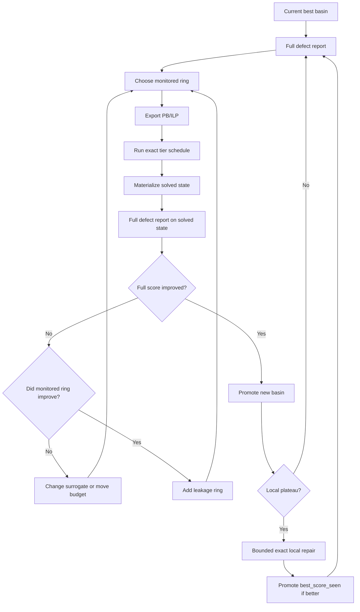

# Hadamard Exact Model Protocol

This note answers the practical question:

`Can this be turned into a scan, or does it have to be tailored step by step?`

The answer is:

- yes, a large part of it can be turned into a repeatable scan
- no, the whole process cannot be reduced to one blind scan yet
- the right shape is a protocol with fixed stages plus adaptive branching

## The Fixed Part

These steps are stable and should be treated as the default protocol:

1. Start from the best preserved basin checkpoint.
2. Run full GS/SDS defect reporting.
3. Read:
   - total score
   - max shift violation
   - top unique SDS defects
   - indicator Fourier deviation
4. Choose a monitored shift set.
5. Export a bounded PB/ILP instance.
6. Run the exact tier schedule.
7. Materialize any solved occupancy state as a real JSON artifact.
8. Run the full defect report on that real state.
9. If a local or exact run contains a better `best_score_seen`, promote that state into its own checkpoint.
10. Repeat from the promoted best real basin.

Those ten steps are the stable scan backbone.

## The Adaptive Part

These decisions still need tailoring:

1. How wide should the monitored shift ring be?
2. Is the current surrogate honest enough?
   - weighted absolute defects
   - square-sum over monitored defects
   - another cap
3. Did the exact solve clean the monitored ring but leak elsewhere?
4. Should the next rung be:
   - bigger PB/ILP ring
   - stronger surrogate
   - bounded exact local repair
   - or a mirror/oracle question?

So the process is not:

`one export -> one solve -> done`

It is:

`export -> solve -> inspect leakage -> adapt -> repeat`

## What Should Be Automated

The following can be fully scripted:

- defect reporting
- shift ranking
- monitored ring export
- PB/ILP generation
- tier schedule generation
- solved-state materialization
- best-score-seen extraction into a standalone checkpoint
- comparison table against the prior basin

That means we can build a repeatable scan harness.

## What Still Needs Judgment

The following still need operator or mirror judgment:

- whether the monitored ring is too narrow
- whether the exact model is “lying” by hiding leakage
- whether the surrogate is helping or distorting
- whether a better exact reduction is needed instead of another local cycle

This is the part that should be logged, not improvised from memory.

## Protocol Diagram

## Mirror Use

The mirror should not be in every loop.

Use the mirror when:

- the exact model keeps improving the monitored ring but harming the full basin
- the same leakage pattern repeats
- a better constraint family is needed
- a new surrogate or reduction is needed

Do not use the mirror just to repeat the current rung verbatim.

The mirror is for:

- new reduction layers
- new invariants
- new exact surfaces

The local code should handle:

- repeated export
- repeated solve
- repeated materialization
- repeated compare

## Decision Rule

Use this decision rule after every rung:

1. If full score improves, promote the new basin.
2. If full score does not improve but the monitored ring improves, widen the ring or strengthen the surrogate.
3. If exact-model output creates a promising intermediate state, hand it back into bounded local repair.
4. If the same failure repeats twice, ask the mirror for a new reduction instead of another blind rerun.

## Current Best Practice

Right now the strongest protocol is:

1. report the full `668` basin
2. export bounded PB/ILP over a monitored ring
3. if monitored-only exact solve leaks, add a second ring
4. prefer a monitored square-sum surrogate over simple weighted absolute defects
5. if the exact-model state is cleaner but still not a new basin, hand it into bounded exact local repair
6. promote any `best_score_seen` basin that beats the current best endpoint

That is the cycle that produced the current local `2880` rung.

