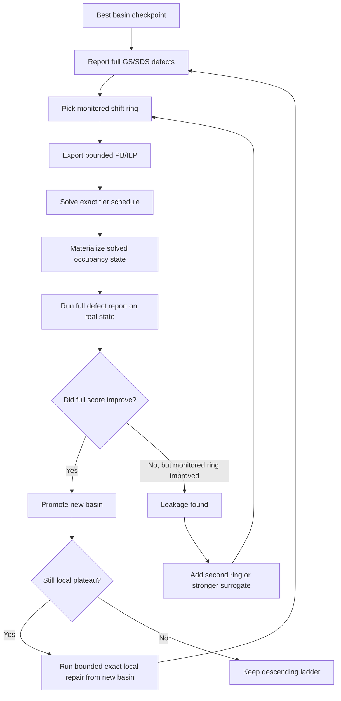

# Hadamard Exact Model Test Map

This note turns the recent `668` exact-model work into one visible map.

The point is to show:

- what we actually tested
- what moved the basin forward
- what failed because the model was too local
- why the next exact rung has to be iterative instead of one blind scan

## Current Ladder

The live `668` GS/SDS ladder now looks like:

| Rung | Artifact / Surface | Result |
| --- | --- | --- |
| 1 | Williamson preserved baseline | `13216` |
| 2 | GS/SDS baseline `(17,17,9,3)` | `5440` |
| 3 | exact polish | `4032` |
| 4 | coupled capped repair | `3456` |
| 5 | heavier coupled capped repair | `3328` |
| 6 | corrected PB/ILP + ring-2 + square-sum + hybrid repair | `2880` |

Best current local artifact:

- `runs/order_668_gs_17-17-9-3_pb_ilp_ring2_sqcap_bestscore_2880_final.json`

## Visual Flow



## What We Tested

### 1. Public bounded PB/ILP export from `3328`

Source basin:

- `runs/order_668_gs_17-17-9-3_coupled_cap_3456_repair_3328_final.json`

Public exported files:

- `runs/order_668_gs_17-17-9-3_coupled_cap_3456_repair_3328_final_pb_ilp.json`
- `runs/order_668_gs_17-17-9-3_coupled_cap_3456_repair_3328_final_pb_ilp_cpsat.py`
- `runs/order_668_gs_17-17-9-3_coupled_cap_3456_repair_3328_final_pb_ilp_tier1.lp`
- `runs/order_668_gs_17-17-9-3_coupled_cap_3456_repair_3328_final_pb_ilp_tier1.opb`
- `runs/order_668_gs_17-17-9-3_coupled_cap_3456_repair_3328_final_pb_ilp_tier2.lp`
- `runs/order_668_gs_17-17-9-3_coupled_cap_3456_repair_3328_final_pb_ilp_tier2.opb`
- `runs/order_668_gs_17-17-9-3_coupled_cap_3456_repair_3328_final_pb_ilp_tier3.lp`
- `runs/order_668_gs_17-17-9-3_coupled_cap_3456_repair_3328_final_pb_ilp_tier3.opb`

Observed issue:

- the first exporter version was wrong
- it subtracted old pair terms inside the compressed occupancy model
- that made even the current basin infeasible

Correction:

- `export_bounded_pb_ilp.py` was fixed so the current basin evaluates to its real monitored deltas

### 2. Monitored-only exact solve

After the exporter bug was fixed:

- tier `K=4, M<=2` solved immediately
- the monitored window got much better
- but the full-basin score got worse

Observed artifact:

- `runs/order_668_gs_17-17-9-3_pb_ilp_tier1_6016_final.json`

Meaning:

- a local exact model can still spill defect mass outside the monitored window

### 3. Second-ring monitored model

Leakage shifts from the first exact solve were added into the monitored set.

This created a larger monitored ring over:

- the original top unique shifts from `3328`
- the first leakage ring revealed by the monitored-only solve

Observed effect:

- the model became more honest
- it no longer looked “good” just because the first 12 shifts were cleaned up

### 4. Stronger surrogate: monitored square-sum

Weighted absolute defects were still too permissive.

So the next exact rung used a square-sum surrogate on the monitored ring, which is closer to the real periodic score:

```text
monitored_square_sum = sum_t u_t^2
```

Observed artifact:

- `runs/order_668_gs_17-17-9-3_pb_ilp_ring2_sqcap_4928_final.json`

Meaning:

- this was the first surrogate that improved the global behavior of the exact model instead of only the monitored window

### 5. Hybrid handoff back into bounded exact local repair

The `4928` exact-model state was not yet a new frontier basin.

But it was structured enough to hand back into bounded exact local repair with the enlarged ring preserved.

Observed rung:

- `runs/order_668_gs_17-17-9-3_pb_ilp_ring2_sqcap_4928_repair_4672_final.json`

Important detail:

- that run finished at `4672`
- but inside the beam it found a much better `best_score_seen = 3392`

### 6. Promote best-score-seen basin, then repair again

That `3392` sub-basin was extracted and promoted into its own checkpoint:

- `runs/order_668_gs_17-17-9-3_pb_ilp_ring2_sqcap_bestscore_3392_final.json`

Then another bounded exact local repair was run from it.

Observed result:

- the run endpoint stayed at `3392`
- but the beam found `best_score_seen = 2880`

Promoted best current local basin:

- `runs/order_668_gs_17-17-9-3_pb_ilp_ring2_sqcap_bestscore_2880_final.json`

## Step-by-Step Rung History

| Stage | Main Idea | Result | What We Learned |
| --- | --- | --- | --- |
| A | first PB/ILP export | infeasible for the wrong reason | exporter bug had to be fixed first |
| B | corrected monitored-only PB/ILP | `6016` | local exact repair can leak globally |
| C | second-ring weighted PB/ILP | `7168` | more honest, still too permissive |
| D | second-ring square-sum PB/ILP | `4928` | better global surrogate |
| E | exact-to-local hybrid from `4928` | beam touched `3392` | exact model can seed a stronger local basin |
| F | local repair from promoted `3392` | beam touched `2880` | this is the first true exact-model-assisted basin win |

## Current `2880` Read

Artifact:

- `runs/order_668_gs_17-17-9-3_pb_ilp_ring2_sqcap_bestscore_2880_final.json`

Current top unique SDS defects:

- `3/164 -> +3`
- `2/165 -> -2`
- `23/144 -> -2`
- `35/132 -> +2`
- `39/128 -> +2`
- `42/125 -> -2`

Current Fourier read:

- indicator nontrivial target: `167`
- indicator Fourier max deviation: `32`

## The Main Lesson

The exact-model process is not a one-shot scan.

It behaves more like:

1. measure the full basin honestly
2. pick a monitored ring
3. solve an exact local model
4. inspect where the defect mass leaked
5. enlarge or reshape the ring
6. hand the improved exact-model state back into bounded local repair
7. promote the best real full-score basin, not just the prettiest exact-model endpoint

That is why the process has to be logged.

The scanable part exists, but only inside a controlled loop.

